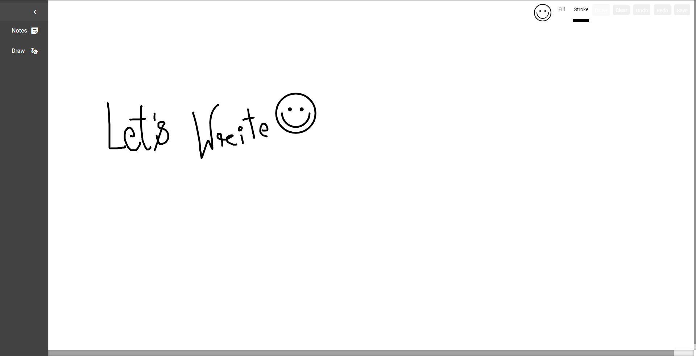
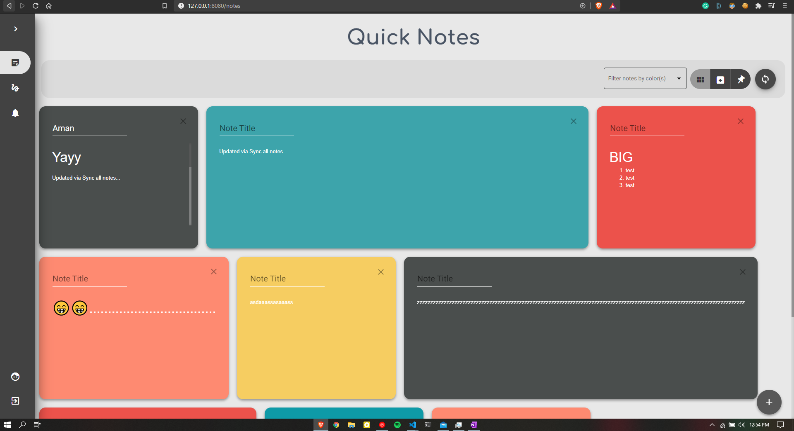

# Quick Notes

An alternate to Window's Sticky Notes with a wide range of features like:

1. Text formatting including font type, size, alignment, color, etc.
2. Support for hyperlinks and images
3. Pin it to the top
4. Mark as read-only
5. Sync notes with your account for any-time access

It also supports drawing on a canvas.

Click here for a live [demo](http://13.127.174.246/)

## Open Issues

1. Multiple color filter is not supported
2. Canvas drawing can only be downloaded
3. Reminders are not functional

## How to run?

### Setup Front-End:

1. Run as Web App:
   - Install dependencies - `npm i`
   - Build the project - `ng build --prod`
   - Navigate to `dist/Notes` and run `http-server -o`
     - Make sure you have `http-server` installed already, run `npm i http-server -g` to install
2. Run as Windows App: `npm start`

### Setup Back-End

1. Clone [this](https://github.com/amannv2/Notes-Backend) repo
2. Install dependencies - `npm i`
3. Start the server - `node server.js`
   - You'll need the connection string for mongodb. So, you can create a cluster on Mongo Atlas and use it's connection string.

## Run using Docker:

1. Pull image from Docker hub - `docker pull amannv2/notes:latest`
2. Run image: `docker run -d -p 80:80/tcp amannv2/notes:latest`
   - Open `localhost:80` on a Web Browser
3. Setup backend as mentioned [above](https://github.com/amannv2/Notes#setup-back-end)

## Screenshots

